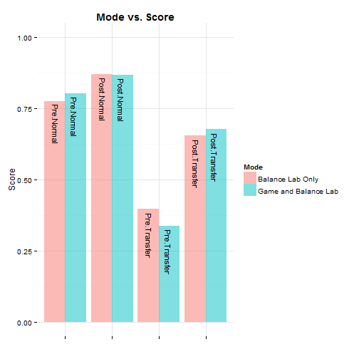
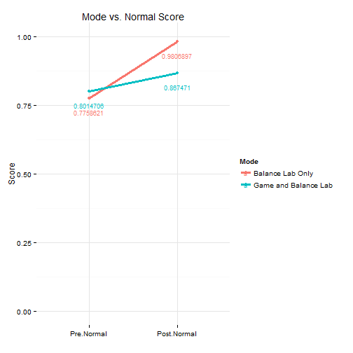
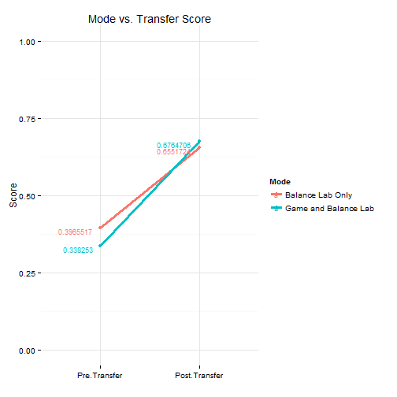

   


```
## 
## 
## processing file: LAVA_Hackathon_2015.rmd
```

```
## 
  |                                                                       
  |                                                                 |   0%
  |                                                                       
  |........                                                         |  12%
##   ordinary text without R code
## 
## 
  |                                                                       
  |................                                                 |  25%
## label: unnamed-chunk-5 (with options) 
## List of 4
##  $ echo   : logi FALSE
##  $ message: logi FALSE
##  $ warning: logi FALSE
##  $ error  : logi FALSE
## 
## 
  |                                                                       
  |........................                                         |  38%
##   ordinary text without R code
## 
## 
  |                                                                       
  |................................                                 |  50%
## label: unnamed-chunk-6 (with options) 
## List of 4
##  $ echo   : logi FALSE
##  $ error  : logi FALSE
##  $ warning: logi FALSE
##  $ message: logi FALSE
## 
## 
  |                                                                       
  |.........................................                        |  62%
##   ordinary text without R code
## 
## 
  |                                                                       
  |.................................................                |  75%
## label: unnamed-chunk-7 (with options) 
## List of 4
##  $ echo   : logi FALSE
##  $ error  : logi FALSE
##  $ warning: logi FALSE
##  $ message: logi FALSE
```

```
## ymax not defined: adjusting position using y instead
```

```
## 
  |                                                                       
  |.........................................................        |  88%
##   ordinary text without R code
## 
## 
  |                                                                       
  |.................................................................| 100%
## label: unnamed-chunk-8 (with options) 
## List of 1
##  $ echo: logi FALSE
```

```
## output file: LAVA_Hackathon_2015_1.md
```

```
## [1] "LAVA_Hackathon_2015_1.md"
```
