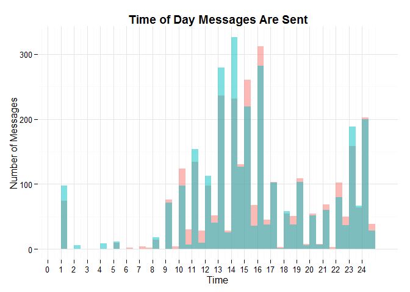
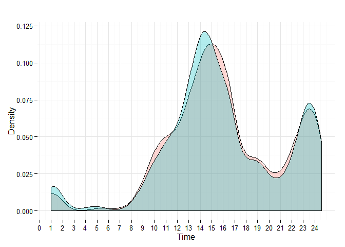

# Text Messaging Analysis

###Histogram
 

###Density Plot
 

####Conclusion: The data were recorded over the span of three months (June 2015 to August 2015). In general, we respond to each other within a short time frame given the fact that we are both in the same time zone. As well, our peak hours of texting are in the early afternoon and before we clock out at around midnight. (We're night owls)
